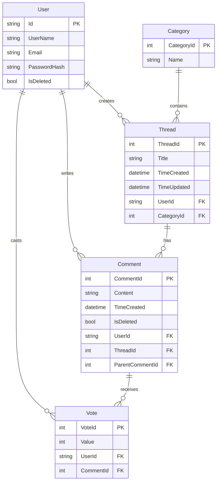

# ChatForum_GroupTwo

A Clean Architecture implementation of a Sports Forum, built with .NET 8, Entity Framework Core and ASP.NET Core Identity.

## Getting Started

### Prerequisites

- .NET 8 SDK

### Running the Application

Both the API and the Blazor frontend must run simultaneously in separate terminals. Start the API first.

**1. Build the solution:**
```
dotnet build Forum.sln
```

**2. Start the API (terminal 1):**
```
dotnet run --project src/Forum.Api/Forum.Api.csproj
```
The API starts at `http://localhost:5141`. Swagger UI is available at `http://localhost:5141/swagger`.
The SQLite database is created and seeded automatically on first run.

**3. Start the Blazor frontend (terminal 2):**
```
dotnet run --project src/Forum.Blazor/Forum.Blazor.csproj
```
Blazor starts at `http://localhost:5159`.

## ER Diagram



**Notes:**
- Admin is a role (via Identity) and not a separate entity.
- Thread body is the first comment (no Body field on Thread) – and comments don't have a header.
- Replies use `ParentCommentId` with a reference to the username and quote of the original comment (not nested).

**Delete behaviour:**
- **User**: Soft-delete (deleting a user does not delete their threads or comments, though should hide their name on them).
- **Category**: Restricted (cannot delete a category containing threads).
- **Thread**: Cascade (deleting a thread should also delete all comments within that thread).
- **Comment**: Soft-delete (deleting a comment should not delete replies to that comment – but replies should refer to it as "deleted").
- **Vote**: Cascade-deleted when parent comment or user is deleted.

## Architecture

```mermaid
flowchart TD
    Blazor["<b>Forum.Blazor</b><br/>Blazor Server UI"]
    Api["<b>Forum.Api</b><br/>ASP.NET Core Minimal API"]
    App["<b>Forum.Application</b><br/>CQRS &#40;MediatR&#41;, DTOs, Interfaces"]
    Infra["<b>Forum.Infrastructure</b><br/>EF Core, Identity, JWT"]
    Domain["<b>Forum.Domain</b><br/>Entity Models"]

    Blazor -- "HTTP calls" --> Api
    Blazor -. "shared DTOs" .-> App
    Api --> App
    Api --> Infra
    Infra --> App
    App --> Domain
    Infra --> Domain

    style Blazor fill:#6d28d9,stroke:#5b21b6,color:#fff
    style Api fill:#2563eb,stroke:#1d4ed8,color:#fff
    style App fill:#0891b2,stroke:#0e7490,color:#fff
    style Infra fill:#059669,stroke:#047857,color:#fff
    style Domain fill:#d97706,stroke:#b45309,color:#fff
```



**Dependency rules:**
```
Dependency rules:
- Domain has no dependencies (pure entities).
- Application depends on Domain; defines repository interfaces, DTOs, and CQRS handlers.
- Infrastructure implements Application interfaces using EF Core and Identity.
- Api depends on Application (sends MediatR commands/queries).
- Blazor calls the Api over HTTP and shares Application DTOs.
```

## File Structure
```
ChatForum_GroupTwo/
├── Forum.sln
├── forum.db                              # SQLite database
└── src/
    ├── Forum.Domain/
    │   └── Entities/                     # User, Category, Thread, Comment, Vote
    ├── Forum.Application/
    │   ├── Common/
    │   │   ├── Interfaces/               # IUnitOfWork, IAuthService
    │   │   └── Models/                   # Result, PagedResult, PaginationParams
    │   ├── DTOs/
    │   │   ├── Auth/                     # LoginRequest, RegisterRequest, AuthResponse
    │   │   ├── Category/                 # CategoryDto, CreateCategoryDto, UpdateCategoryDto
    │   │   ├── Thread/                   # ThreadSummaryDto, ThreadDetailDto, CreateThreadDto,
    │   │   │                             # UpdateThreadDto, ThreadFilterParams
    │   │   ├── Comment/                  # CommentDto, CreateCommentDto, UpdateCommentDto,
    │   │   │                             # CommentFilterParams
    │   │   ├── User/                     # UserDto, UserProfileDto, UpdateUserProfileDto,
    │   │   │                             # ChangePasswordDto, UserFilterParams
    │   │   └── Vote/                     # CastVoteDto, VoteResponseDto
    │   ├── Features/
    │   │   ├── Auth/Commands/            # RegisterUser, LoginUser
    │   │   ├── Categories/Commands/      # CreateCategory, UpdateCategory, DeleteCategory
    │   │   ├── Categories/Queries/       # GetAllCategories, GetCategoryById
    │   │   ├── Threads/Commands/         # CreateThread, UpdateThread, DeleteThread
    │   │   ├── Threads/Queries/          # GetThreads, GetThreadById, GetThreadsByCategory,
    │   │   │                             # GetThreadsByUser
    │   │   ├── Comments/Commands/        # CreateComment, UpdateComment, DeleteComment
    │   │   ├── Comments/Queries/         # GetComments, GetCommentById, GetCommentsByThread,
    │   │   │                             # GetCommentsByUser, GetReplies
    │   │   ├── Users/Commands/           # UpdateUserProfile, ChangePassword, DeleteUser
    │   │   ├── Users/Queries/            # GetUserById, GetUserProfile, GetAllUsers, GetPagedUsers
    │   │   └── Votes/Commands/           # CastVote
    │   ├── Repositories/                 # IRepository<T>, ICategoryRepository, IThreadRepository,
    │   │                                 # ICommentRepository, IUserRepository, IVoteRepository
    │   ├── Mappings/                     # MappingExtensions.cs
    │   └── DependencyInjection.cs
    ├── Forum.Infrastructure/
    │   ├── Data/                         # ForumDbContext, ForumContextFactory, DbSeeder
    │   ├── Migrations/                   # EF Core migrations
    │   ├── Repositories/                 # Repository, UnitOfWork, CategoryRepository,
    │   │                                 # ThreadRepository, CommentRepository,
    │   │                                 # UserRepository, VoteRepository
    │   ├── Services/                     # AuthService (JWT generation)
    │   └── DependencyInjection.cs
    ├── Forum.Api/
    │   ├── Endpoints/                    # AuthEndpoints, CategoryEndpoints, ThreadEndpoints,
    │   │                                 # CommentEndpoints, UserEndpoints, VoteEndpoints
    │   ├── Extensions/                   # ClaimsPrincipalExtensions, ProblemDetailsMapping
    │   └── Program.cs
    └── Forum.Blazor/
        ├── Components/
        │   ├── Layout/                   # MainLayout.razor, NavMenu.razor
        │   └── Pages/                    # Home, Login, Register, Logout, Profile, Admin,
        │                                 # Threads, CategoryThreads, ThreadDetails,
        │                                 # CreateThread, Error
        ├── Services/                     # ApiClientBase, ApiAuthenticationStateProvider,
        │                                 # TokenStorageService, AuthService, CategoryService,
        │                                 # ThreadService, CommentService, UserService
        ├── Interfaces/                   # IAuthClientService, ITokenStorageService
        ├── Models/                       # LoginRequest, LoginResponse, RegisterRequest, AuthResult
        ├── wwwroot/                      # Static assets, Bootstrap, custom CSS
        └── Program.cs
```

## Seeded Data

The database is seeded automatically on first run with the following test data.

### Users

| Username     | Password    | Email              | Role  |
|--------------|-------------|--------------------|-------|
| `admin`      | `Admin123!` | admin@forum.com    | Admin |
| `john_doe`   | `User123!`  | john@example.com   | —     |
| `jane_smith` | `User123!`  | jane@example.com   | —     |

### Categories and Threads (one per category)

| Category   | Thread Title                                          | Author     |
|------------|-------------------------------------------------------|------------|
| Formula 1  | 2025 Season Predictions - Who takes the championship? | john_doe   |
| Football   | Champions League Semi-Finals Discussion               | jane_smith |
| Basketball | NBA Playoffs - Who's making it out of the West?       | john_doe   |
| Tennis     | Is Sinner the new GOAT?                               | jane_smith |
| Hockey     | Stanley Cup contenders this year                      | admin      |
| Golf       | Masters 2025 - Early favorites?                       | john_doe   |
| Cycling    | Tour de France route looks insane this year           | jane_smith |
| Rugby      | Six Nations 2025 - Ireland vs France was incredible   | admin      |

### Comments

Each thread has 2–3 comments. The first comment serves as the thread body. One nested reply is seeded on the Formula 1 thread to demonstrate the reply feature.

## User Scenarios

### Scenario 1: Register a new account

A guest registers with a username, email, and password. The server creates the account and returns a JWT token for immediate authentication. Passwords must be at least 6 characters and include at least one digit, one lowercase letter, and one uppercase letter (no special character required).

```http
POST /api/auth/register
Content-Type: application/json

{
  "username": "new_fan",
  "email": "fan@example.com",
  "password": "SecurePass123!"
}
```
```json
{ "token": "eyJhbGci...", "userId": "a1b2c3...", "username": "new_fan", "email": "fan@example.com" }
```

> JWT tokens expire after 24 hours. After expiry the client must log in again to obtain a new token.

### Scenario 2: Reply to a comment

A logged-in user replies to another user's comment by clicking "Reply" on their comment. The reply is displayed by setting `parentCommentId` and showing a "replying to @username" label and a quoted excerpt of the original comment.

```http
POST /api/comments/1
Authorization: Bearer <token>
Content-Type: application/json

{
  "content": "Disagree — Norris has been incredibly consistent lately.",
  "parentCommentId": 3
}
```

### Scenario 3: Admin soft-deletes a user

An admin soft-deletes a user account. The user's threads and comments are preserved but the author name is replaced with "Deleted User".

```http
DELETE /api/users/a1b2c3
Authorization: Bearer <token>
```

## Smoke Tests

15 GWT (Given-When-Then) smoke tests cover every API endpoint group. The tests are defined as `.http` requests in [`src/Forum.Api/Forum.Api.http`](src/Forum.Api/Forum.Api.http) and documented in [`docs/smoke_tests_documentation.md`](docs/smoke_tests_documentation.md). Run them top-to-bottom after starting the API.

| # | Endpoint | Scenario | Expected |
|:-:|----------|----------|----------|
| 1 | `POST /api/auth/register` | Register new user | 200 |
| 2 | `POST /api/auth/login` | Login as admin | 200 |
| 3 | `POST /api/auth/login` | Login as regular user | 200 |
| 4 | `GET /api/categories` | Get all categories | 200 |
| 5 | `POST /api/categories` | Create category (admin) | 201 |
| 6 | `POST /api/categories` | Create category (regular user) | 403 |
| 7 | `GET /api/threads` | Get all threads (paginated) | 200 |
| 8 | `GET /api/threads/{id}` | Get thread by ID | 200 |
| 9 | `POST /api/threads` | Create thread | 201 |
| 10 | `GET /api/comments/thread/{id}` | Get comments by thread | 200 |
| 11 | `POST /api/comments` | Create comment | 201 |
| 12 | `POST /api/comments` | Create comment (unauthenticated) | 401 |
| 13 | `GET /api/users/{id}` | Get user profile | 200 |
| 14 | `PUT /api/users/{id}` | Update own profile | 200 |
| 15 | `GET /api/users/{id}` | Get non-existent user | 404 |


## Extended features (VG)

### Voting

Logged-in users can upvote (▲) or downvote (▼) comments. The score is shown between the arrows, coloured green (positive), red (negative) or grey (zero). Clicking the same arrow undoes the vote; clicking the opposite switches it. Guests see the arrows but cannot interact.

- **Domain** — `Vote` entity with `VoteId`, `Value` (+1/−1), `UserId`, and `CommentId`.
- **Application** — `IVoteRepository`, `CastVoteCommand`/`CastVoteCommandHandler`, `CastVoteDto`, and `VoteResponseDto`.
- **Infrastructure** — `VoteRepository` implementation, EF Core migration (`AddVoteEntity`) adding the Votes table with a unique index on `(UserId, CommentId)`.
- **Api** — `POST /api/comments/{commentId}/votes` endpoint with `[Authorize]`.
- **Blazor** — Vote arrows rendered per comment, score display with colour coding, and authenticated state check.

### Pagination, Filtering & Sorting

All list endpoints return paginated results via `PagedResult<T>` with page metadata (total count, current page, has next/previous). Threads can be filtered by category, author, search term (title), and date range, and sorted by newest, oldest, most comments, recently updated, category, or author. Comments support filtering by thread, author, and date range.

- **Application** — `PaginationParams` base class, `PagedResult<T>` wrapper, `ThreadFilterParams`, `CommentFilterParams`, and `UserFilterParams` DTOs.
- **Infrastructure** — `GetPagedAsync` methods on `ThreadRepository`, `CommentRepository`, and `UserRepository` with EF Core `IQueryable` filtering and sorting.
- **Api** — Query parameters on `GET /api/threads`, `GET /api/comments`, and `GET /api/users` endpoints.
- **Blazor** — Sort dropdowns and configurable page sizes on the Admin Panel (threads and users tabs) with first/last/previous/next navigation.

### Brute-Force Protection

Login attempts are rate-limited using ASP.NET Core Identity's built-in lockout. After 5 failed attempts the account is locked for 15 minutes. Each failed login returns how many attempts remain before lockout, and a locked account returns the minutes until unlock.

- **Api** — `Program.cs` configures `options.Lockout` (5 attempts, 15-minute window, enabled for new users).
- **Infrastructure** — `AuthService.LoginAsync` calls `CheckPasswordSignInAsync` with `lockoutOnFailure: true`, checks `IsLockedOut`, and returns remaining attempts or lockout duration in the error message.

### User History

Each user's profile displays their activity history: a **My Threads** tab listing their created threads and a **My Comments** tab listing their comments, both with pagination.

- **Application** — `UserProfileDto` includes `RecentThreads` and `RecentComments`. `GetThreadsByUser` and `GetCommentsByUser` queries return paginated results.
- **Infrastructure** — `ThreadRepository` and `CommentRepository` filter by `UserId`.
- **Api** — `GET /api/threads/user/{userId}` and `GET /api/comments/user/{userId}` endpoints.
- **Blazor** — Profile page with tabbed "My Threads" / "My Comments" views and pagination controls.

### Admin Panel

The admin panel (`/admin`) provides a management dashboard with three tabs:

 **Categories** — View all categories with thread counts, create new categories, and delete empty categories (categories containing threads cannot be deleted).

 **Threads** — Paginated thread list with sorting (newest, oldest, category, author) and configurable page size. Admins can delete any thread.

 **Users** — Paginated user list with sorting (username, threads, comments) and configurable page size. Admins can rename users inline or soft-delete them. Deleted users show as "Deleted".

- **Api** — `GET /api/users` (admin-only), existing category/thread endpoints with admin authorization checks.
- **Blazor** — `Admin.razor` page guarded by `<AuthorizeView Roles="Admin">`.
