# Fas 2 – Avstämning

> Kort avstamp inför Fas 3. Max 1–2 rader per punkt + länkar/prints.

## 1) EF Core + SQLite (databasbevis)
- **Körda migrationer**: 
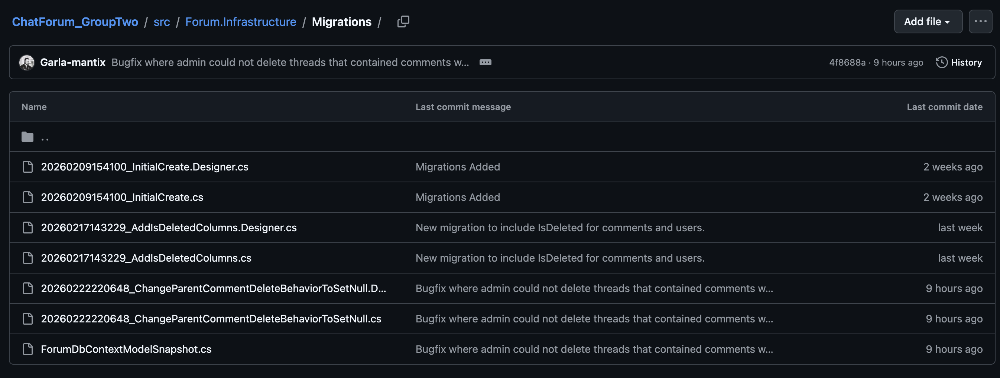 

- **Var SQLite-filen ligger**:    
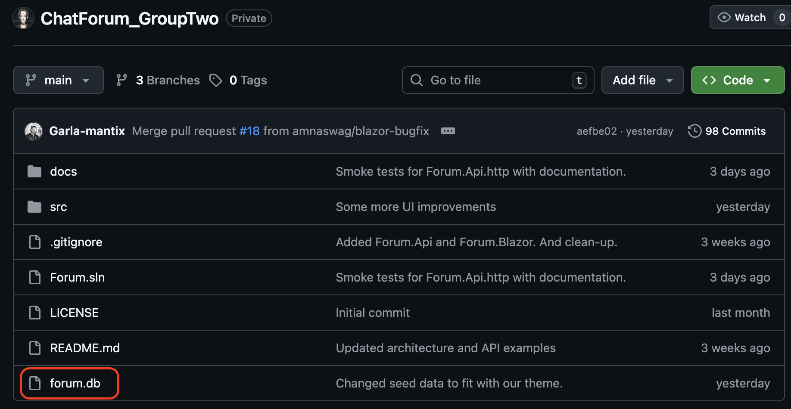

- **Seed/testdata**:    
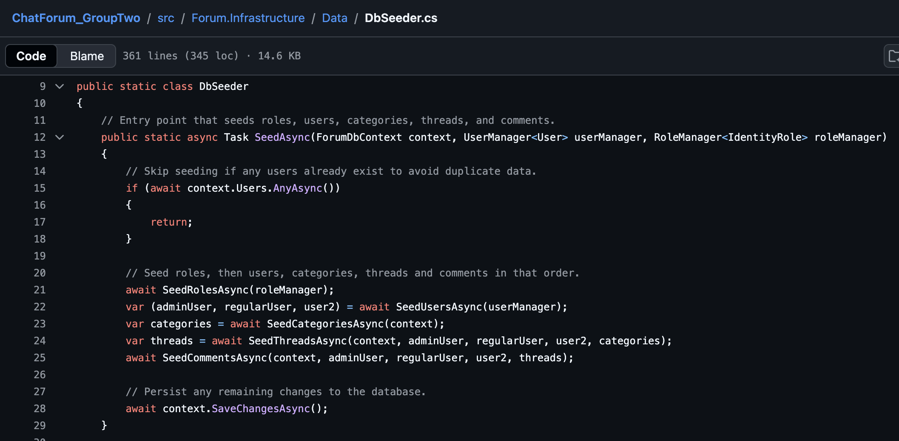    
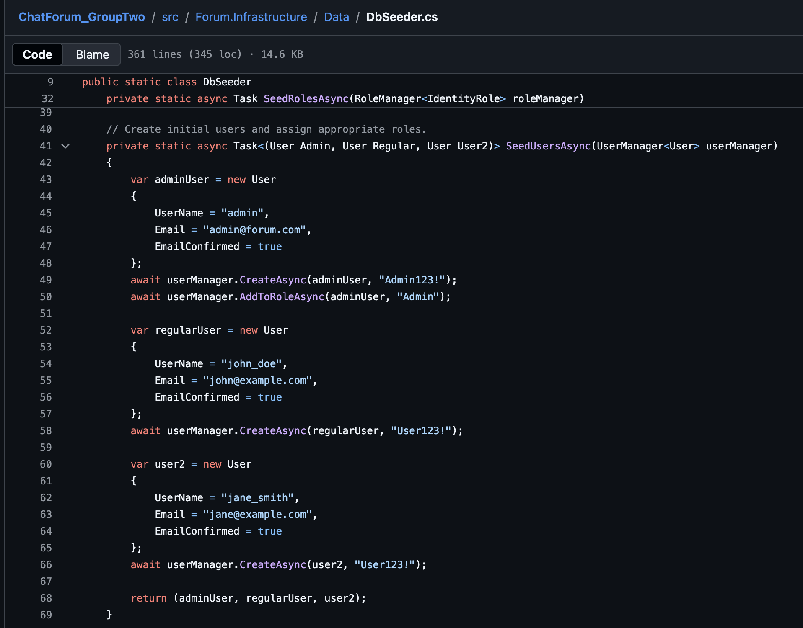    
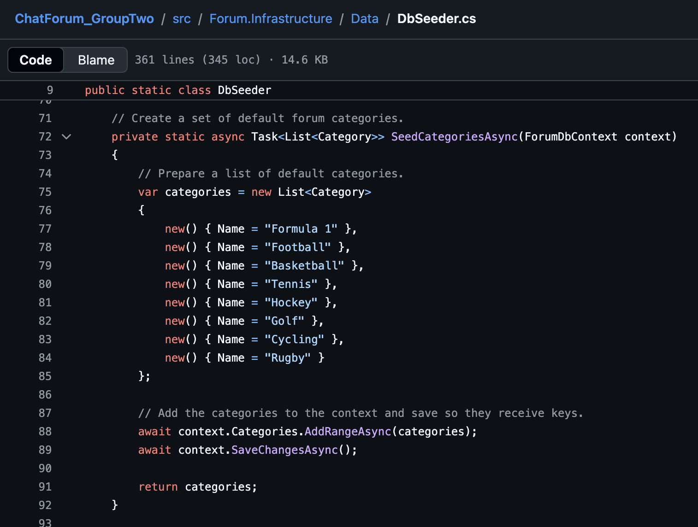    

- **Hur man aktiverar det**:    
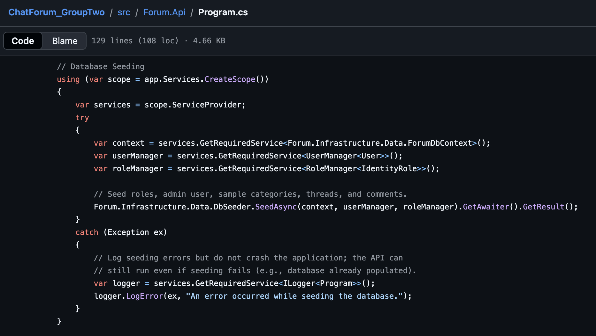
<!-- Krav i projekt-PM: EF Core + SQLite. -->

## 2) API-kontrakt & felmodell
- **Lista 2–4 kärnendpoints + vilka statuskoder ni VERIFIERAR via .http**:   
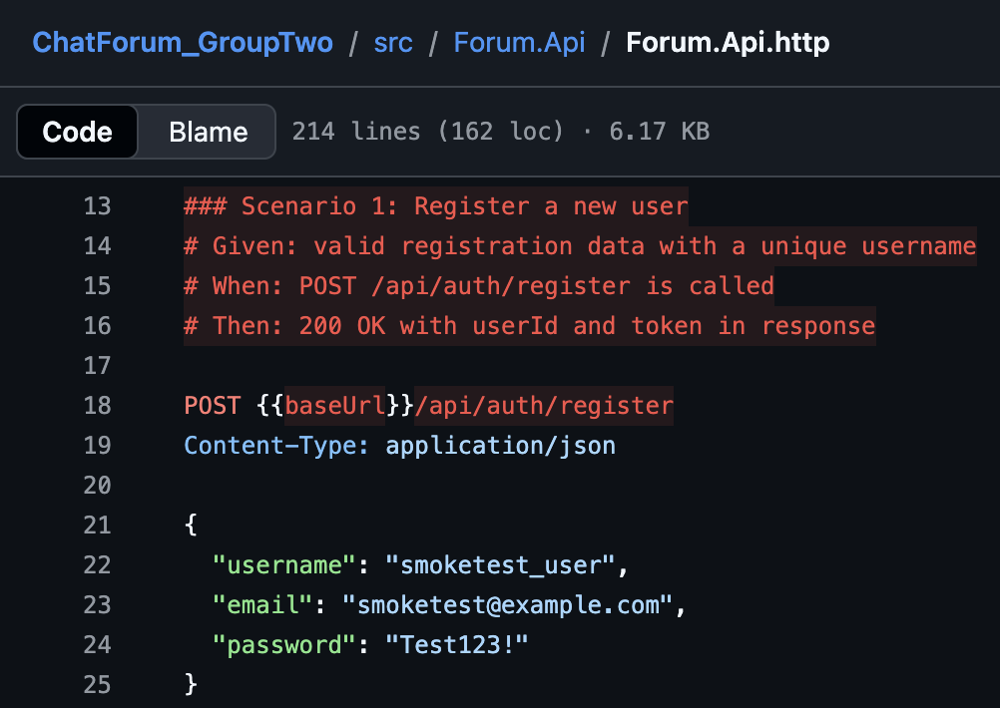    
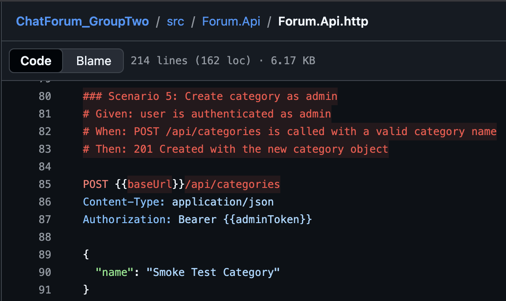    
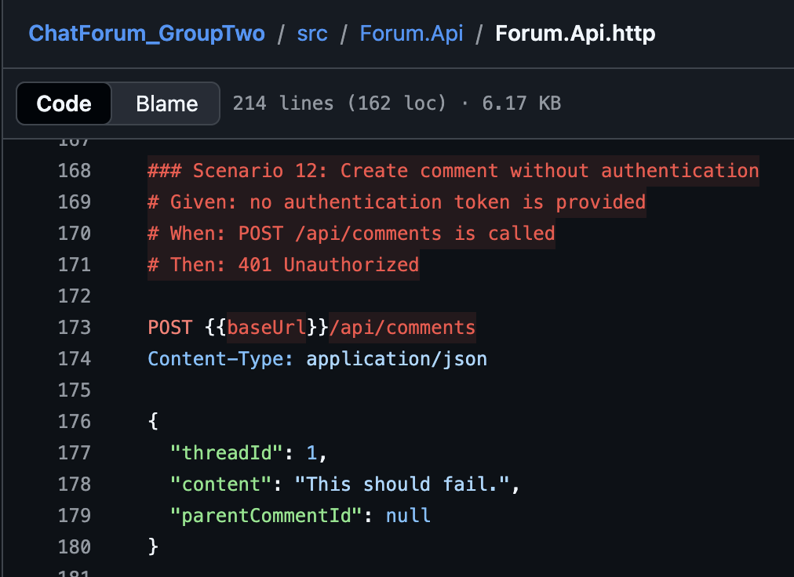    

<!-- Statuskodspolicy + ProblemDetails enligt undervisningspolicyn. -->

## 3) ProblemDetails
- **Kort: var/när returnerar vi ProblemDetails (t.ex. 400/404)**:    
**Var**: I våra API endpoints och application usecases.   
**När**: Då API:et anropas genom interaktion med blazor.

## 4) Blazor – UI-flöde
- **1 gif/print som visar: lista → detalj → skapa → visa (mot API)**.   
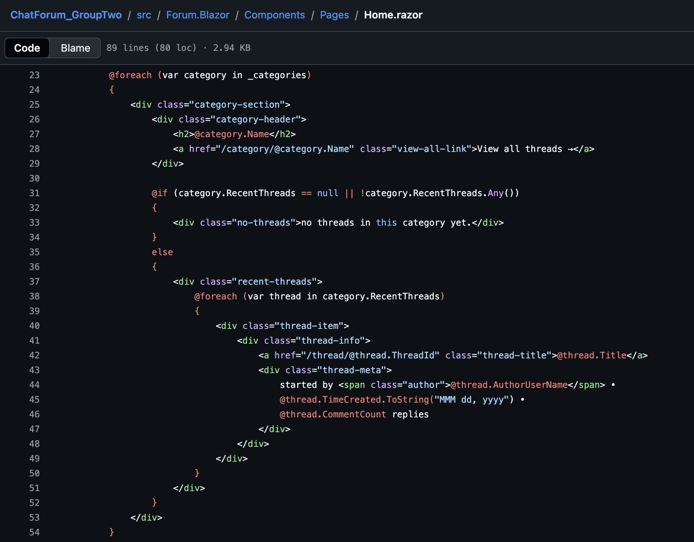    
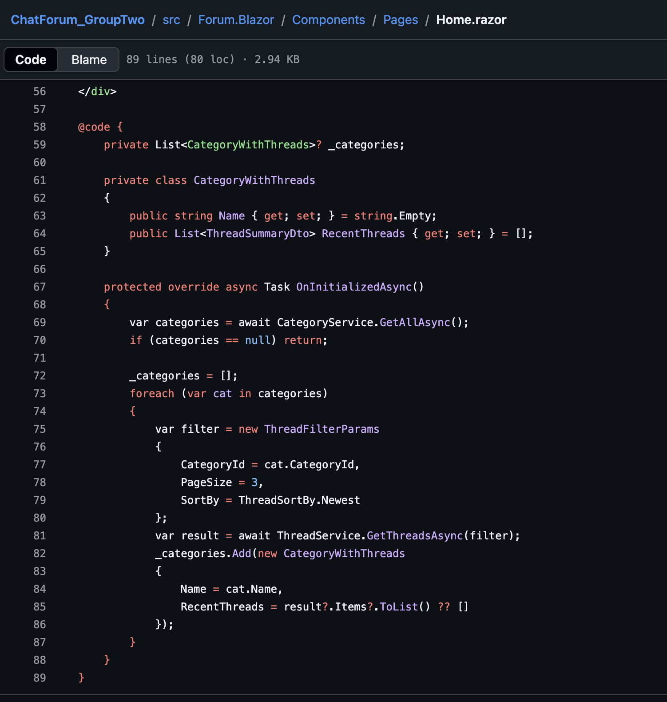    

## 5) Identity & roller
- **Bekräfta att registrering/inloggning fungerar + att skyddad endpoint kräver behörighet (401/403)**.   
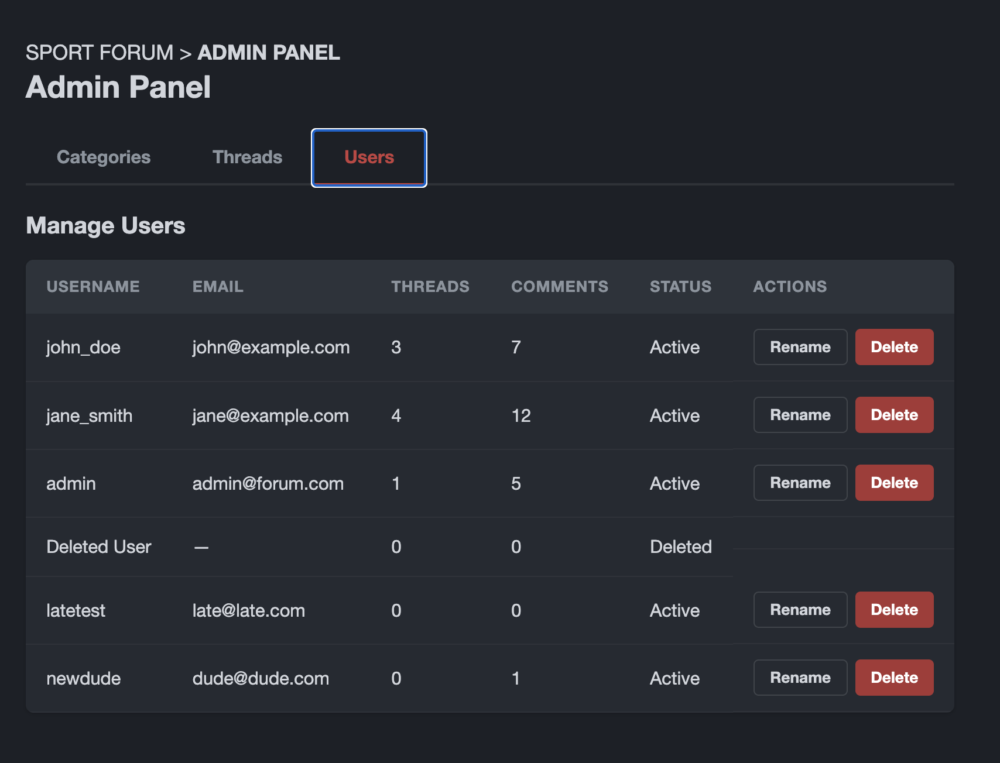    
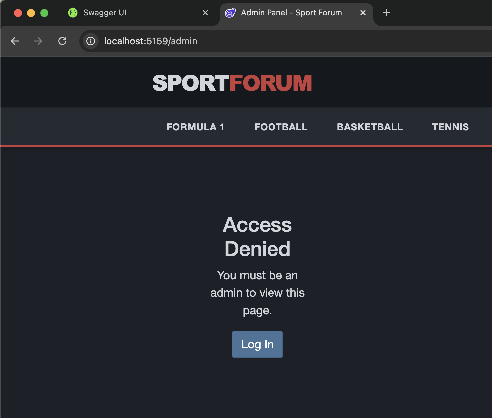    

- **Kort: hur UI-gate syns (t.ex. dolda knappar)**.   
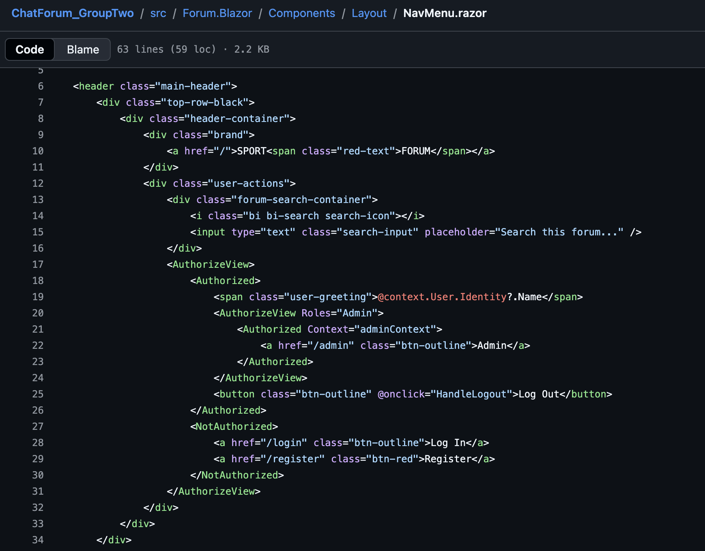    

## 6) README & körning
- **Länk till README med 3 användarscenarier + körinstruktioner + seed/testdata**.  
https://github.com/amnaswag/ChatForum_GroupTwo/blob/9430a4a1063872e1de66923a49b00f03eeac4d53/README.md

## 7) PR-disciplin
- Länk till senaste merged PR mot `main` som rör ett kärnflöde.  
https://github.com/amnaswag/ChatForum_GroupTwo/pull/21 
